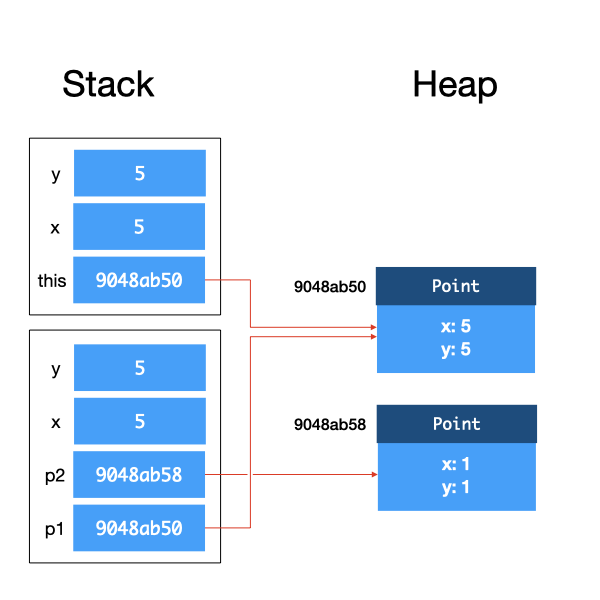

# Fundamentals of Java

Java is a **strongly typed**, **statically typed** language that supports both object-oriented and [functional-style programming](../functional-style-programming/), which will be explored in a later section. This section will focus heavily on how Java works internally.

## Executing Java Programs

The processing unit of a computer can only accept and understand instructions written in machine code. Programs written in higher-level languages need to be translated into machine code before execution, and tombstone diagrams are a way to visualize how we go from computer programs to machine code. Tombstone diagrams have four types of components:

1. Programs which are implemented in a specific language;
2. Interpreters which translate a program in Language A to a program in Language B;
3. Compilers which convert a program written in Language A to a program written in Language B;
4. Physical machines which understand a specific language.

<figure><figcaption>
The four different component types of tombstone diagrams.
</figcaption></figure>

One key feature of all our tombstone diagrams is that the languages in the connecting components are the same. That is, a program `P` implemented in Language `A` goes together with either an interpreter that takes in Language `A`, or a compiler which takes in Language `A`.

<figure><figcaption>
Sample tombstone diagram.
</figcaption></figure>

For Java, programs can be executed in two ways: by compilation into bytecode, or interpretation by a Java interpreter. The first approach uses a compiler, reading the entire program and translating it into machine code, which is saved into an executable file for later use. The second approach uses an interpreter, software that reads in the program one statement at a time, interprets what the statement means, and executes it.

<figure><figcaption>
Compiling a Java program into bytecode.
</figcaption></figure>

When Java is compiled into bytecode, the **Java Virtual Machine (JVM)** interprets and compiles the bytecode on the fly into machine code, readable by our x86-64 machines. Note that compilers do more than translate our source code into machine code or bytecode; they also need to parse the source code written and check if it obeys the **grammar** of the language, i.e., the specifications of the programming language. The compiler will then produce a **syntax error** if grammar is violated (e.g., a missing semicolon).

<figure><figcaption>
Role of the JVM.
</figcaption></figure>

If our program is interpreted by a Java interpreter, the program is read and processed line by line.

<figure><figcaption>
The <code>jshell</code> interpreter.
</figcaption></figure>

## Stack and Heap Diagrams

We now take a closer look at the JVM. The JVM manages the memory of Java programs while its bytecode instructions are interpreted and executed. Different JVM implementations may implement these differently, but a typical JVM implementation partitions the memory into several regions, including the **method area** for storing code for the methods; the **metaspace** for storing meta information about classes; the **heap** for storing dynamically allocated objects, and the **stack** for local variables and call frames.

The **heap** is the region in memory where all objects are allocated in and stored, while the **stack** is the region where all variables (including primitive types and object references) are allocated in and stored.

<figure><figcaption>
Example of a stack and heap diagram.
</figcaption></figure>

When we invoke methods, the JVM creates a **stack frame** for this instance method call. The first stack frame is therefore going to be the stack frame for `main`. The stack frame is a region of memory that contains the `this` reference, the method arguments, and local variables within the method. When a method returns, the stack frame for that method is destroyed.

There are two further details we should note about the stack frames:

1. When class methods are called, the stack frame does not contain the `this` reference, as class methods are not tied to a particular instance of the class.
2. References to objects are copied onto the stack frame, while the values of primitives are copied over. In other words, Java uses **call by value** for primitive types, and **call by reference** for objects. If multiple nested method calls are made, the stack frames get stacked on top of each other.

Finally, the JVM runs a **garbage collector** that checks for unreferenced objects on the heap and cleans up the memory automatically. This is different from the destruction of stack frames once a method has returned, but serves a similar purpose (decluttering the program).

