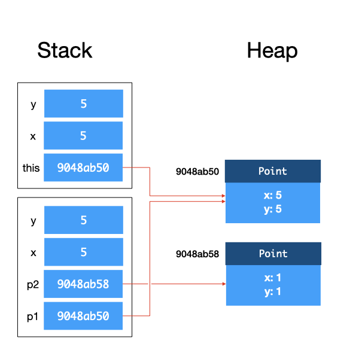

# spam content document

## 0

* Choice of programming language: Java
  * Strongly typed
  * Static typing
  * Subjects both object-orient and functional-style programming
* Functions are important in taming code complexity
  * Allows programmers to compartmentalize computation and its effects, reducing the number of interactions to a few well-defined ones (through arguments and return values)
  * Hides implementation details so that they can be changed later without affecting other parts of the code
  * Reuse computations and write code that is more succinct and easier to understand/change
* Abstraction principle: each significant piece of functionality in a program should be implemented in just one place in the source code.
* Erecting an abstraction barrier. Separate the role of a programmer into two: the implementer, who implements the function, and the client, who calls the function.
  * Implementer should compartmentalize the internal variables and implementation of the function behind abstraction barrier - only the parameters and return values are exposed to the outside world
* A **software program** is a collection of data variable and instructions on how to modify thee variables
* The processing unit of a computer can only accept and understand instructions written in machine code. Programs written in higher-level languages need to be translated into machine code before execution.
  * The first approach uses a compiler, reading rhe entire program and translating it into machine code, which is saved into an executable file for later use.
  * The second approach uses an interpreter, software that reads in the program one statement at a time, interprets what the statement means, and executes it.
* Java programs can be executed in two ways: compilation into bytecode, or interpretation by a Java interpreter.
  * Java can be compiled into bytecode. During execution, bytecode is interpreted and compiled on-the-fly by the **Java Virtual Machine (JVM)** into machine code.
    * .png>)
    * .png>)
  * Java can be interpreted by the Java interpreter.
    * .png>)
* Tombstone diagrams have the following components:
  * Programs which are implemented in a particular language
  * Language A to Language B interpreters
  * Language A to Language B compilers which are implemented in a Language C
    * Compilers do more than translate source code into machine code or bytecode; they also need to parse the source code written and check if it follows the precise specification of the programming language used (the **grammar**), and produce a **syntax error** if grammar is violated.
    * This is different from a runtime error, which might occur when a customer is actually using the program
  * Physical machines implementing a particular language.
  * .png>)
  * We can draw tombstone diagrams, as long as the connected components are the same language.
    * .png>)
* A **variable** is an abstraction that allows us to give a user-friendly name to a piece of data in memory. We use the **variable name** whenever we want toa ccess the **value** in that location, and **pointer to the variable** or **reference to the variable** wheneveer we want to refer to the address of the location.
* We can assign a **type** to a variable, communicating to the reader what data type the variable is an abstraction over, and to the compiler/interpreter what operations are valid on this variable and how the operation behaves.
  * Python and Javascript are **dynamically typed** programming languages, where the same variable can hold values of different types.
  * Java is a **statically typed** language, where we need to declare every variable we use in the program and specify its type. Once a variable is assigned a type, its type cannot be changed.
  * The type that a variable is assigned with when we declare the variable is known as the **compile-time type**. During compilation, this is the only type that the compiler is aware of. The compiler will check if the compile-time type matches when it parses the variables, expressions, values, and function calls, and throw an error if there is a type mismatch.
  * A **type system** of a programming language is a set of rules that govern how the types can interact with each other. Programming languages can be either strongly typed or weakly typed; strongly typed languages enforce strict rules to enforce type safety and catch type errors during compile time rather than runtime.
  * There are two categories of types in Java: **primitive types** and **reference types**.
    * Primitive types hold numeric values as well as boolean values. In Java, the `byte`, `short`, `int`, `long`, `char`, `float`, `double`, and `boolean` data types are all primitive. Unlike reference types, primitive type variables never share their value with each other, i.e., they all keep their individual copies.
  * Let `S` and `T` be two types. We say that `T` is a **subtype** of `S` if a piece of code written for variables of type `S` can also be safely used on variables of type `T`. We use the notation `T<:S` or `S:>T` to denote that `T` is a subtype of `S`. We use the term **supertype** to denote the reversed relationship.
    * For our primitives, Java has the following subtyping relationships:
      * `byte` <: `short` <: `int` <: `long` <: `float` <: `double`
      * `char` <: `int`
    * Java allows a variable of type `T` to hold a value from a variable of type `S` only if `S<:T`. This is known as **widening type conversion**, and can occur during assignment or parameter passing.
* Another important abstraction provided by a programing language is the **function**. This abstraction allows programmers to group a set of instructions and give it a name. This named set of instructions may take one or more variables as input parameters and return one or more values.
  * Functions help us deal with complexity in a few ways:
    * Functions allow programmers to compartmentalize computation and its effects.
    * Functions allow programmers to hide how a task is performed, reducing code complexity for the client and allowing the implementer to change the implementation later.
    * Functions reduce repetition through code reuse, making code more succinct and reducing the number of places in our code that we need to modify.
  * We can imagine an **astraction barrier** between the code that calls a function and the code that defines the function body. Above the barrier, the concern is about using the function to perform a task, while below the barrier, the concern is about how to perform the task. The abstraction barrier thus enforces a separation of concerns between the roles of the implementer and the client.
* A **composite data type** allows programmers to group primitive types together, give it a name (a new type), and refer to it later.
  * We can further bundle the composite data type and its associated functions on the same side of the abstraction barrier together, into another abstraction called a **class**.
  * A class is a data type with a group of functions associated with it. The functions are called **methods**, and the data in the class are called **fields** (or **members**, or **states**, or **attributes**).
  * The concept of keeping all the data and functions operating on the data related to a composite data type together within an abstraction barrier is called **encapsulation**.
  * Just like we can create variables of a given type, we can create **objects** of a given class. Objects are **instances of a class**, each alllowing the same methods to be called, and each containing the same set of variables of the same types.
    * In Java, the `new` keyword creates an object of a given class.
  * A program written in an **object-oriented language** such as Java consists of classes, with one main class as the entry point.
    * We can view running an OO program as something that instantiates objects of different classes and orchestrates their interactions with each other by calling each others' methods.
  * Everything in Java that isn't a primitive type is a reference type. Unlike primitive variables, which never share a value, a reference variable stores only the reference to the value, and therefore two reference variables can share the same value.
  * Any reference variable that is not initialized will have the special reference value `null`.Declaring a reference variable and trying to use it without instantiating an object will lead to a run-time error message for a `NullPointerException`.
* Many OO languages allow programmers to explicitly specify if a field or a method can be accessed from outside the abstraction barrier.
  * Java supports `private` and `public` access modifiers. Fields and methods that are declared as `private` cannot be accessed from outside the class, and can only be accessed within the class. On the other hand, a `public` field or method can be accessed, modified, or invoked from outside the class.
  * Such a method to protect the abstraction barrier from being broken is called **data hiding**, or **information hiding**. This protection is enforced by the compiler at compile time.
  * A method that initializes an object is called a **constructor**. In Java, a constructor method has the same name as the class and has no return type. It can take in arguments just like other functions.
  * The `this` keyword is a reference variable that refers back to itself, and is used to distinguish between two variables of the same name. Although not necessary, it helps the programmer make it explicit that we are referring to a field in the class, rather than a local variable or a parameter.
* Similar to providing constructors, a class should also provide methods to retrieve or modify the properties of the object. These methods are called the **accessor** (or **getter**) or **mutator** (or **setter**) methods.
  * The "Tell, Don't Ask" principle broadly says we should add functions to do things, instead of directly retrieving the fields of a variable in order to perform the computations ourselves. In an ideal world, we will define our classes without any accessors or modifiers to the private fields, and force ourselves to think in the OO way.
* In our programs, we sometimes have universal constants (such as the number `e`, or the number `pi`). These constants will not change throughout our program, and we therefore should not associate these constants with an object. We therefore associate these **global** values and functions with a class.
  * To associate a method or a field with a class in Java, we declare them with the `static` keyword, and use the `final` keyword to indicate that the value of the field will not change.
  * Static fields which are associated with a class are called **class fields**, and fields that are associated with an object are **instance fields**.
  * Note that static fields need not be final, and need not be public.
  * Class fields behave just like global variables, and can be accessed in the code anywhere that the class can be accessed.
  * For example, to use the static class field `PI`, we need to use `java.lang.Math.PI`, which can be shortened by writing an import statement of the form `import java.lang.Math;`, which allows us to call `PI` as `Math.PI` subsequently.
  * Similar to static fields, a static method is associated with a class, and is therefore known as a **class method**. Class methods are invoked without being attached to an instance, and therefore cannot access its instance fields or instance methods. The reference `this` has no meaning within a class method. Class methods are accessed through the class.
  * Every Java program has a class method called `main`, which serves as the entry point to the program. The main method must be defined as `public final static void main(String[] args) {}`, which takes in an array of strings as parameters. These are the command-line arguments that we can pass in when invoking `java`.
* The principle of **composition** refers to the bundling of reference types together to create a more complex reference type.
  * Composition models a HAS-A relationship between two entities; for example, a circle has a point as the center.
  * Recall that unlike primitive types, reference types may share the reference values, known as **aliasing**. This affects our code, as mutating one variable may result in unintended side effects.
    * One possible solution is to avoid sharing references as much as possible. However, one drawback to this is that we will have a proliferation of objects, and the computational resource usage is not optimized.
    * Another approach to address this issue is immutability, which will be covered later.
* Let's jump back to our JVM for a while. The JVM manages the memory of Java programs while its bytecode instructions are interpreted and executed. Different JVM implementations may implement these differently, but a typical JVM implementation partitions the memory into several regions, including the **method area** for storing code for the methods; the **metaspace** for storing meta information about classes; the **heap** for storing dynamically allocated objects, and the **stack** for local variables and call frames.
  * The **heap** is the region in memory where all objects are allocated in and stored, while the **stack** is the region where all variables (including primitive types and object references) are allocated in and stored.
  * 
  * When we invoke methods, the JVM creates a **stack frame** for this instance method call. The stack frame is a region of memory that contains the `this` reference the method arguments, and local variables within the method.
    * When class methods are called, the stack frame does not contain the `this` reference.
    * Observe that the references to objects are copied onto the stack frame, while the values of primitives are copied over.
    * After a method returns, the stack frame for that method is destroyed.
  * To summarize, Java uses **call by value** for primitive types, and **call by reference** for objects. If multiple nested method calls are made, the stack frames get stacked on top of each other.
  * The JVM runs a **garbage collector** that checks for unreferenced objects on the heap and cleans up the memory automatically.
* We can introduce the subtype relationship in Java using the `extends` keyword when declaring our classes. We call the original class the **parent class** or **superclass** of the extended class, which is a **subclass** of the parent class. We say that the subclass **inherits** from the parent class, since all public fields and public methods are now accessible to the child class. However, all private fields and methods remain inaccessible to the child class.
  * We use the `super` keyword in Java to call the constructor of the superclass and initialize it.
  * This is the concept of **inheritance**, which is a model for an IS-A relationship between two entities.
  * Inheritance should only be used if it preserves the subtyping relationship.
  * Recall that Java allows a variable of type `T` to hold a value from a variable of type `S` only if `S<:T`. Therefore, we can declare an object of type `T` as `T t = new S();`. In this case, `T` is the compile-time type of `t`, while assignment of `t` to an object of type `S` only happens during run-time, and `S` is the **run-time type** of `t`.
* In Java, every class that does not extend another class inherits from the `Object` class implicitly. The `Object` class does not encapsulate anything in particular, but has two very useful methods which are common to all objects.
  * The `toString` method is invoked implicitly by Java, by default, to convert reference objects to a `String` object during string concatenation.
    * The `Object::toString` method isn't very helpful, as it prints the reference location in memory, instead of fun facts about the object that we want. We therefore need to perform **method overriding**, to alter the behaviour of the `toString` method to suit our new classes.
    * We define the **method signature** of a method as the method name and the number, type, and order of its parameters, and the **method descriptor** as the method signature plus the return type.
    * Whe a subclass defines an instance method with the same method descriptor as an instance method in the parent class, we say that the instance method in the subclass **overrides** the isntance method in the parent class, and we use the `@Override` annotation to denote this.
  * **Method overloading** is when we have two or more methods in the same class with the same name but a differing method signature. In other words, the method name is the same, but the type, order, and number of parameters is different.
    * As the class constructor is also a method, it is possible to overload the class constructor as well.
    * It is also possible to overload static class methods in the same way as instance methods.
  * Method overriding enables **polymorphism**, which allows us to change how existing code behaves without changing a single line of the existing code.
    * The method being invoked on a variable is decided during run-time, depending on the run-time type of the object. This is called **dynamic binding**, or **late binding**, or **dynamic dispatch**.
    * The `Object::equals` method compares if two object references refer to the same object. However, we could have two objects which are practically speaking the same, but have simply been instantiated twice. We therefore need to override the `Object::equals` method to check if two objects are **semantically** the same.
      * We can write a generic `equals` method that'll work for any class. \<Insert it here>
        * The statement that assigns `obj` to `circle` involves **type casting**.
        * Java allows type casting from type `T` to type `S` if `S<:T`. This is called **narrowing type conversion**. Unlike widening type conversions, which are always allowed and always correct, narrowing type conversions require explicit typecasting and validation during runtime.
    * Polymorphism allows us to write succinct code that is future proof. By dynamically deciding which method implementation to execute during run-time, the implementer can write short and general code that works for existing classes as well as new classes that might be added in future by the client.
* Method invocation is very troublesome and requires lots of thinking, since there are now a world of overloaded and overriden methods that the Java compiler needs to sift through.
  * Java decides which method to use in a two-step process.
  * The first step occurs during compilation, where Java determines the method descriptor of the method invoked, using the compile-time type of the target.
    * To determine the method descriptor, the compiler searches for all methods that can be correctly invoked on the givern argument.
    * When theere are multiple methods that can correctly accept the argument, we choose the most specific one.
    * Once the method is determined, the method's descriptor is stored in the generated code.
  * The second step occurs during execution.
    * The method descriptor from the first step is first retrieved, before the run-time type of the target is determined.
    * Let the run-time type of the target be `R`. Java first looks for an accessible method with the matching descriptor in `R`. If no such method is found, Java will continue up the class hierarchy until `Object`. The first method implementation with a matching method descriptor found will be the one executed.
  * This description only applies to instance methods, as class methods do not support dynamic binding. For class methods, the method to invoke is resolved statically during compile time. The same process in the first step is taken, but the corresponding method implementation will always be executed during run-time, without considering the run-time type of the target.
* The **Liskov Substitution Principle (LSP)** says that "Let `Φ(x)` be a property provable about objects `x` of type `T`. Then `Φ(y)` should be true of objects `y` of type `S` where `S<:T`."
  * This is a fancy way of saying that a subclass should not break the expectations set by the superclass. In other words, all instances of a parent class should be substitutable by an instance of the subclass.
    * If it is not substitutable, LSP is volated.
  * We also realize that it is useful for developers to prevent certain classes from being inherited. We can therefore use the `final` keyword on a class to tell Java that a class cannot be inherited. Alternatively, we can allow inheritance but prevent specific methods from being overriden, through declaring those methods as `final`.
* We can boost our abstraction game to the next level through the concept of an **abstract class**. In Java, abstract classes are something which have been made into something so general that it cannot and should not be instantiated. This is usually because one or more of its instance methods cannot be implemented without further details.
  * To declare an abstract class in Java, we add the `abstract` keyword to the class declaration. To make a method abstract, we add the `abstract` keyword when we declare the method.
  * Abstract methods cannot be implemented and therfore do not have a method body.
  * Abstract classes only need to have at least one abstrac method.
  * A class that is not abstract is a **concrete class**. Concrete classes cannot have any abstract methods, and must therefore override all abstract methods of a parent abstract class.
* One thing we realize is that an abstract class is really just a nice way of saying we want our group of objects to all have the following methods, which each subclass will implement differently.
  * We can also package this in an abstraction known as an **interface**, which is declared using the `interface` keyword.
  * All methods in an interface are `public abstract` by default, and we can tell Java that a class implements a particular interface through the `implements` keyword.
  * Both concrete and abstract classes can implement interfaces.
  * Take note that a class can only extend from one superclass, but it can implement multiple interfaces. An interface can extend from one or more other interfaces, but an interface cannot extend from another class.
  * If a class `C` implements an interface `I`, `C<:I`. This definition implies that a type can have multiple supertypes.
    * This is cool, because it means that we can declare variables as being of an interface type, although they're actually referencing an object that implements that interface.
    * It even allows explicit type casting to an interface, since the Java compiler cannot rule out the possibility that a subclass implements an interface as well.
  * Java actually allows interfaces to provide default implementation of methods that all implementation subclasses will inherit (unless they override it). These methods are tagged with the `default` keyword and leads to inelegant situations where an interface has both abstract and non-abstract methods. These are referred to as **impure interfaces**, and will not be discussed in CS2030S.
* Java also provides **wrapper classes** for each of its primitive types. Wrapper classes encapsulate a type, rather than fields and methods.
  * This lets us work with primitive types as though they were objects, which lets us use methods on them too.
  * All primitive wrapper classes are **immutable** - once an object is created, it cannot be changed.
  * As changing between the primitive type and its wrapper class is pretty common, Java provides a feature called **auto-boxing/unboxing** to perform type conversions between primitive types and its wrapper class.
  * Although working with wrapper classes is nice, we also want to somewhat avoid this, because it comes with costs for allocating memory and collecting garbage afterwards, making it less efficient than primitive types.
* **Type casting** is a way for programmers to tell the compiler to trust that the objects returned by a method are of a specific run-time type. We type cast through the addition of `(Type)` in front of an object reference when declaring variables or some shit idk
* Unfortunately, the subtype relationship between complex types such as arrays is nontrivial. The **variance of types** refers to how the subtype relationship between complex types relates to the subtype relationship between components.
  * Let `C(S)` correspond to some complex type based on type `S`; an array of type `S` is an example of a complex type.
  * A complex type is **covariant** if `S<:T` implies `C(S)<:C(T)`.
  * A complex type is **contravariant** if `S<:T` implies `C(T)<:C(S)`.
  * A complex type is **invariant** if it is neither covariant nor contravariant.
  * Arrays of rerence types are covariant in Java, which unfortunately leads to some dangers down the lines with run-time types.
* Let us talk about one other issue: exception handling. In Java, exception handling is performed using the `try`, `catch`, and `finally` keywords, along with a hierarchy of `Exception` classes.
  * The `try`-`catch`-`finally` framework allows us to handle exceptions.
  * However, if we want to throw an exception, we need to use the `throws` keyword to declare that our method will throw an exception. Furthermore, we will need to create a new `Exception` object and throw it to the caller using the `throw` keyword.
  * Java distinguishes between two types of exceptions: checked and unchecked exceptions.
    * An **unchecked exception** is an exception caused by programmer error, and should not happen if perfect code is written. These errors are usually not explicitly caught or thrown. In Java, all unchecked exceptions are subclasses of the class `RuntimeException`.
    * A **checked exception** is an exception that a programmer has no control over. Checked exceptions must be handled, or the program will not compile.
  * If unchecked exceptions are not caught, they will propagate down the stack until they are either caught or an error message is displayed to the user.
  * Checked exceptions must be handled. Good programs handle checked exceptions gracefully and hide the details from the user.
  * Note that the `finally` block is always executed even if a `return` or `throw` statement is written in a `catch` block.
  * We can also write our own exceptions by inheriting an existing exception. However, we should only create new exception types if we need them to provide more useful information to the exception handler.
  * When we override a method that throws a checked exception, the overriding method must throw only the same, or a more specific checked exception, than the overriden method. This helps the method obey LSP.
  * **Pokemon Exception Handling** is catching the `Exception` class exception within a `catch` block. This is terrible, because every exception will be caught and we won't know if our program is throwing unintended exceptions as well.
  * We should, as much as possible, handle the implementation-specific exceptions within the abstraction barrier.
  * Finally, don't use exceptions as a control flow mechanism.
  * Java also has an `Error` class for situations where the program should terminate as there is no way to recover from the error. For example, a `StackOverflowError` and `OutOfMemoryError` occur when the stack or the heap is full. In CS2030S, we don't need to create or care about such errors.
