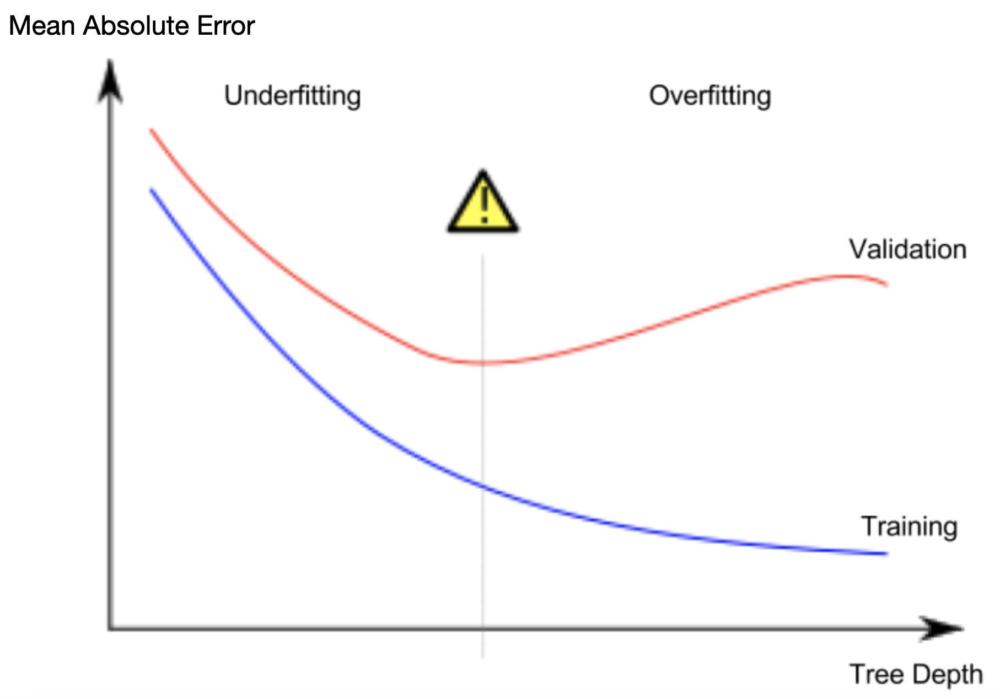

# Intro to Machine Learning (Kaggle)

## Decision Tree

Decision trees partition data sets based on a given attribute possessed by the data. This step of capturing patterns is called **fitting** or **training** the model. The data used to **fit** the model is called the **training data**. After the model has been fitted, we can apply it to new data to **predict** features of the data based on the attribute that the model has been trained on. Our decision trees can be improved by increasing the number of layers, therefore increasing the granularity of our predictions.

<figure><figcaption><p>Copied from the Kaggle course.</p></figcaption></figure>

The point at the bottom of a tree where a prediction is made is called a **leaf**.

## Basic Exploratory Data Analysis

The first step in any ML project is to get to know the data better, which we do so using `pandas`. We first need to read and save our data file into a variable, and we can then use the `.describe()` function to get a quick summary of the data.

```python
import pandas as pd

file_path = "file_name.csv"
data = pd.read_csv(file_path)

data.describe()
```

The `.describe()` function gives us an eight-number summary, of the count, mean, standard deviation, minimum, maximum, median, and Q1 and Q3.

## Building Simple Models

We return to our data set to select both the variable to predict, as well as the variables to base the prediction off. We can then use the `scikit-learn` library to build a simple model. There are several steps we take to build a model:

1. Define: what type of model are we using? What parameters will it have?
2. Fit: train the model on some data
3. Predict: use the trained model to predict the values we want for new data.
4. Evaluate: determine how accurate the model's predictions are

```python
from sklearn.tree import DecisionTreeRegressor
import pandas as pd

file_path = "file_name.csv"
data = pd.read_csv(file_path)

feature_list = ['f1', 'f2', 'f3']
X = data[feature_list] # features for the decision tree
y = data.f4 # predicted variable

data_model = DecisionTreeRegressor(random_state=1) # random_state is a seed
data_model.fit(X, y)
predictions = data_model.predict(new_data)
```

